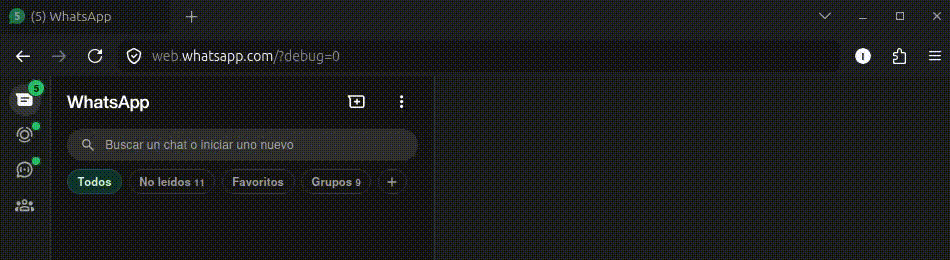

<h1 align="center">Chatter Toggle Extension</h1>

  

A lightweight browser extension designed to optimize your workspace by allowing you to easily hide or show the chat panel on demand.

## Features

* **Dynamic Hiding:** Completely conceals the side chat panel to improve the visibility of the main content area.
* **Integrated Control:** Intuitively toggles on and off simply by clicking the chat button located on the left panel.

## Installation

1. Download or clone this repository to your local machine.
2. Open your browser's extensions management page (`chrome://extensions` for Chromium-based browsers or `about:debugging` for Firefox).
3. Enable **Developer mode**.
4. Click on **Load unpacked** (or **Load Temporary Add-on**) and select the root folder of this project.

## Usage

Once installed, the extension runs automatically on the target pages. Simply click the chat icon on the left side panel to toggle the visibility of the chatter area.
